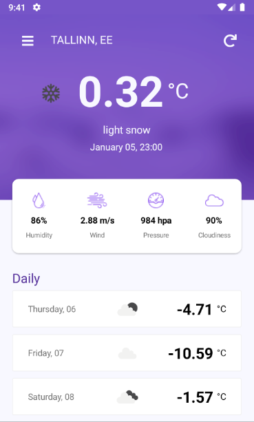
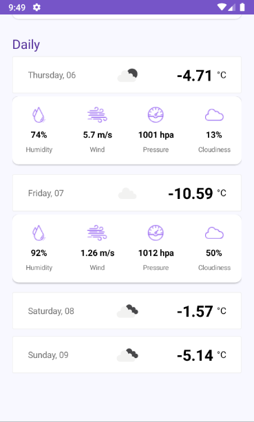
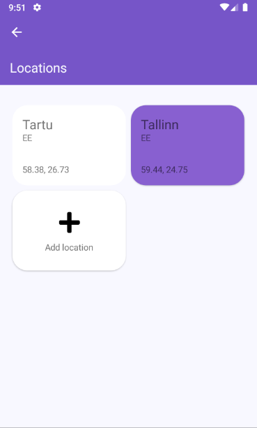
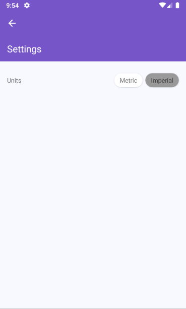

# Weather App

Make a weather app that gives current weather information and shows 5 weather forecast for the desired city.\
UI design inspired by https://github.com/devcrux/WeatherApp

## Examples

### Main

|  |  |
| :------------------------------------------: | :------------------------------------------------: |

### Locations

|  |  |
| :-----------------------------------------------: | :---------------------------------------------------: |

### Settings

