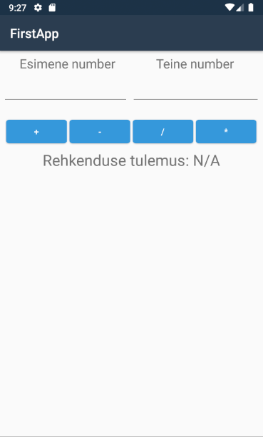
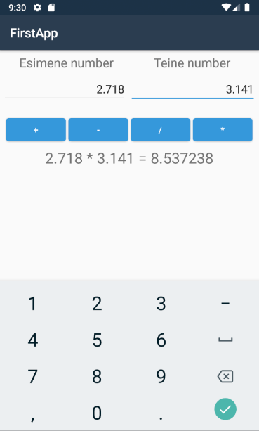

# Moobilirakendused
Mobile applications made for school assignements.  

All applications made using Xamarin and for Android only.
Example images made using Google Pixel 2 emulator (9.0 (Pie) - API 28)

## Calculator App
First application - a simple calculator app.

### Examples
#### Main

#### Calculation

## Notes App
App that saves and displays notes.

### Examples
#### Main

#### Note Edit

## Weather App
Make a weather app that gives current weather information and shows 5 weather forecast for the desired city.

#### Examples
TODO

