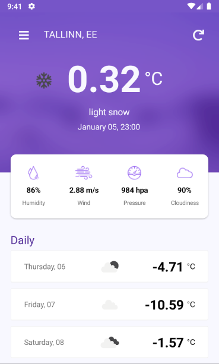
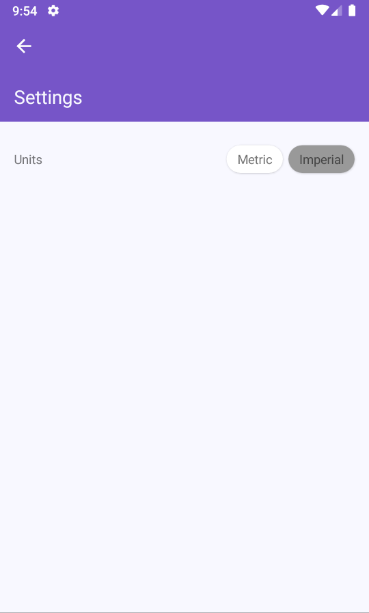
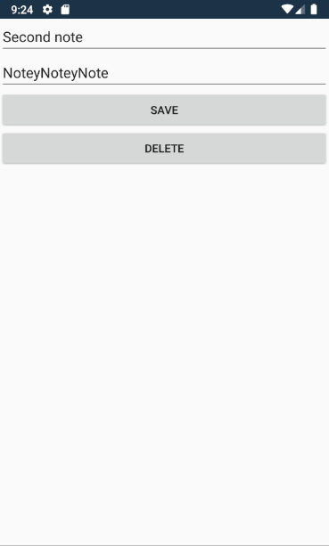

# Mobiilirakendused

Mobile applications made for school assignements.

All applications made using Xamarin and for Android only.
Example images made using Google Pixel 2 emulator (9.0 (Pie) - API 28)

## Weather App

Make a weather app that gives current weather information and shows 5 weather forecast for the desired city.\
UI design inspired by https://github.com/devcrux/WeatherApp

### Examples

#### Main

|  |  |
| :-----------------------------------------: | :-----------------------------------------------: |

#### Locations

|  |  |
| :----------------------------------------------: | :--------------------------------------------------: |

#### Settings

## Calculator App

First application - a simple calculator app.

### Examples

#### Main

|                    Main                     |                 Calculation Result                 |
| :-----------------------------------------: | :------------------------------------------------: |
|  |  |

## Notes App

App that saves and displays notes.

### Examples

#### Main

|                  Main                  |                 Note Edit                  |
| :------------------------------------: | :----------------------------------------: |
|  |  |
